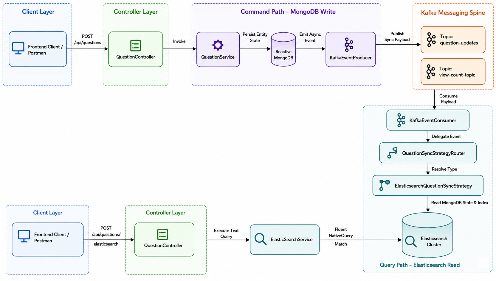

# Quora Backend - High-Concurrency Reactive CQRS Stack

This repository hosts a production-grade, fully reactive, non-blocking Quora backend. Designed from first principles to handle massive user concurrency, the system decouples transactional mutations from computationally heavy reads using an event-driven **Command Query Responsibility Segregation (CQRS)** architecture.

---

## 🏗 System Architecture

The overall backend acts as a highly decoupled ecosystem where public write requests drop events onto a distributed messaging network, freeing worker nodes to process background calculations (such as real-time full-text indexing and content sanitization) out-of-band.

```text
                          ┌──────────────────────┐
                          │  Client Applications │
                          └──────────┬───────────┘
                                     │ REST (HTTP)
                                     ▼
                          ┌──────────────────────┐
                          │Question/Answer Engine│  :8080 (WebFlux Application)
                          └──────────┬───────────┘
                                     │
    ┌────────────────────────────────┼────────────────────────────────┐
    │ Transactional                  │ Asynchronous Event             │ Read Queries
    ▼                                ▼ Spine                          ▼

┌───────────────┐            ┌───────────────────────┐            ┌───────────────┐
│ Reactive Mongo│            │     Apache Kafka      │            │ Elasticsearch │
│  (Write DB)   │            │(Internal: 9092 Broker)│            │ (Search Index)│
└───────────────┘            └───────────┬───────────┘            └───────────────┘
                                         │
                ┌────────────────────────┴────────────────────────┐
                ▼                                                 ▼
      ┌────────────────────┐                           ┌────────────────────┐
      │ Moderation Worker  │                           │ Elasticsearch Sync │
      ├────────────────────┤                           ├────────────────────┤
      │ • Purgomalum API   │                           │ • CQRS Strategy    │
      │ • WebClient Async  │                           │ • Document Builder │
      └────────────────────┘                           └────────────────────┘
```

### CQRS Architecture Deep-Dive

For a comprehensive breakdown of the query/command isolation layer, background worker processing loops, and event stream boundaries, please refer to the visual design specifications located in our dedicated asset documentation:



---

## Technical Feature Set

* **Reactive Web Architecture**: Leverages **Spring WebFlux** over an asynchronous event-loop execution network, eliminating thread-per-request blocking bottlenecks.
* **CQRS Search Processing**: Segregates full-text text lookups into a dedicated **Elasticsearch** engine cluster utilizing fluent `NativeQuery` configurations with typo tolerance (`fuzziness: AUTO`) and weighted title scoring (`title^2.0`).
* **Asynchronous Content Moderation**: Integrates an autonomous filtering service using non-blocking **WebClient** configurations to interface with external REST engines (**Purgomalum API**), sanitizing dirty content without reducing client response throughput.
* **Dual Pagination Framework**: Out of the box support for high-throughput client viewports using structured base64-encoded **Cursor-based pagination** (ideal for infinite feeds) and traditional metadata-wrapped offset pagination models.
* **Real-time Content Polling**: Employs timestamp cursor polling (`GET /api/questions/poll`) to dynamically stream newly published platform items matching `createdAt > cursor` parameters with minimal database resource consumption.
* **Asynchronous View-Count Tracking**: Decouples analytical read increments away from core entity payload generation loops by publishing read actions directly to dedicated distributed Kafka message lines.

---

## Design Patterns & SOLID Compliance

The codebase focuses heavily on strict architectural boundaries, readability, and structural maintainability:

### 1. Strategy Pattern (Decoupled Micro-Operations)

Conditional logic branches inside our asynchronous Kafka consumers are eliminated entirely. Instead, actions run through highly extensible strategy routers:

* **`IQuestionSyncStrategy` / `IAnswerCreatedStrategy`**: Blueprints declaring implementation identification codes (`getSyncType()`) and execution blocks (`process()`).
* **`QuestionSyncStrategyRouter` / `ViewCountStrategyRouter`**: Dynamic registry components that autowire collection implementations into isolated maps at startup, matching event actions cleanly to honor the **Open/Closed Principle**.

### 2. Adapter Pattern (Decoupled Schema Ecosystem)

* **`QuestionMapper` / `AnswerMapper`**: Complete isolation blocks that wrap conversion routines among core transactional persistence models (`Question`), analytical search wrappers (`QuestionDocument`), and strict external contracts (`QuestionResponseDTO`).

---

## Test & Validation Metrics

Robustness and reactive backpressure flow controls are fully validated inside the test suite framework:

* **JUnit 5 Component Tests**: Enforces structured testing using unit configurations (`@ExtendWith(MockitoExtension.class)`).
* **Reactor-Test Suites**: Employs Project Reactor's **`StepVerifier`** to meticulously assert non-blocking streams, catching asynchronous data elements (`expectNextMatches`) and bounding failure exceptions securely.

---

## Infrastructure Setup & Local Execution

### 1. Database & Broker Initialization

This project runs a hybrid environment. Core transactional and event broker systems run natively on your machine via Homebrew, while the search cluster runs isolated via Docker Compose.

**Start Local Services (macOS Native):**

```bash
# Start MongoDB Community Edition
brew services start mongodb-community

# Start Zookeeper and Apache Kafka Broker
brew services start zookeeper
brew services start kafka
```

**Start Search Engine (Docker Container):**

Ensure Docker is active and run the setup command from the project root to spin up the single-node Elasticsearch instance:

```bash
docker compose up -d
```

### 2. Compile and Boot the Server

Compile project dependencies and launch the reactive application server locally on port `8080`:

```bash
./gradlew bootRun
```